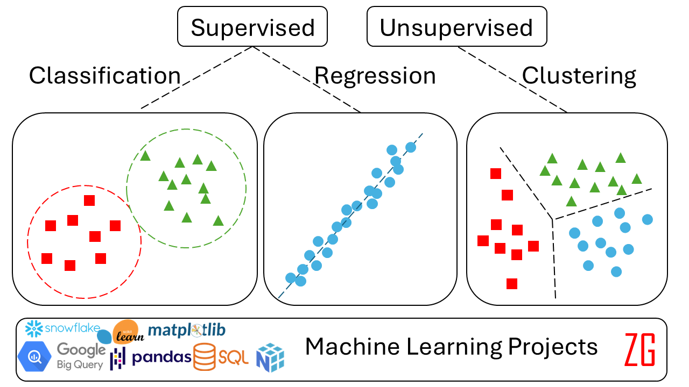

[> "Perfection is the enemy of good." — Voltaire](https://ziraddin-gulumjan.onrender.com/)

This repository focuses on implementing core **ML algorithms** from scratch. I prioritize clear, readable, and functional code over exhaustive hyperparameter tuning. The goal is to understand the *mechanics*, not just chase the last 0.1% of accuracy.

Also see my:

[Jupyter Book Version](https://ziraddingulumjanly.github.io/MLBook/intro.html)

[Machine Learning Projects](https://ziraddin-gulumjan.onrender.com/data-analytics/)

[Master Publications](https://ziraddin-gulumjan.onrender.com/papers/)

